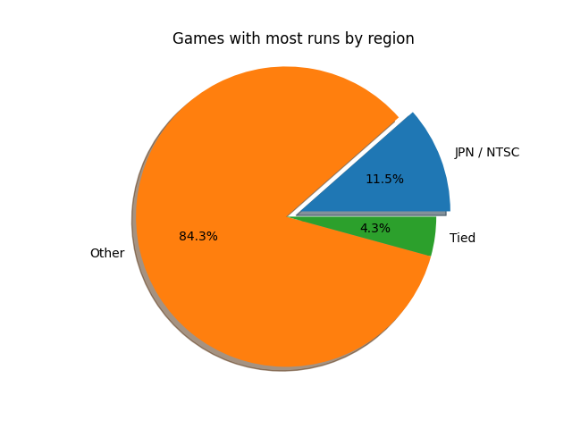
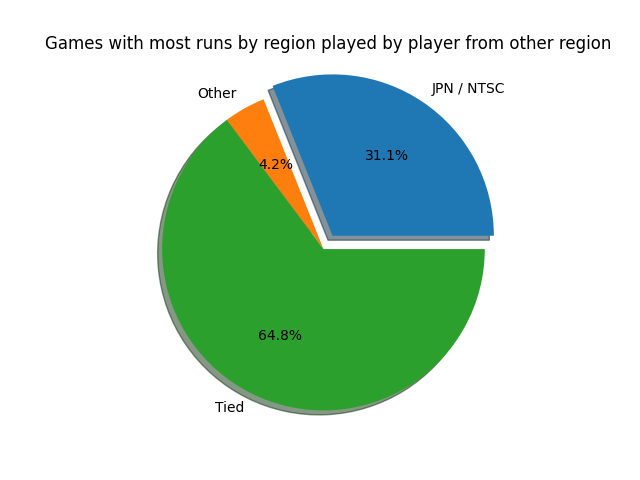
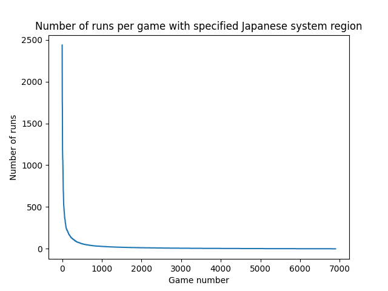

# speedrun-project
This repository contains scripts to fetch data from Speedrun.com API
and generate statistics from the collected data.  

Its aim is to find out how distribution of game version region which is speedrunned
and decide how often are Japanese versions used.    

This is a school project seminar work for HRY01.

## About statistics
Speedrun.com currently (7 jan 2023) stores data about 32 284 games in total.
8 498 of them have "JPN / NTSC" as one of its versions and 6 900 of them have at least one other version.  

Statistics are made of runs from `/runs` endpoint consisting of all runs including obsolete ones which were
needed to be filtered out. Each user has up to one best run for each game.  
Runs without system region specified and games without runs were also excluded.

### Generated results





- More correlation data can be found in `Statistics.pdf` file.

## Setup

```bash
poetry install
poetry shell
```

## Fetch data
Might take approximately 6-7 hours.

```bash
python src/fetch_data.py
```

## Generate statistics

```bash
python src/generate_statistics.py
```
